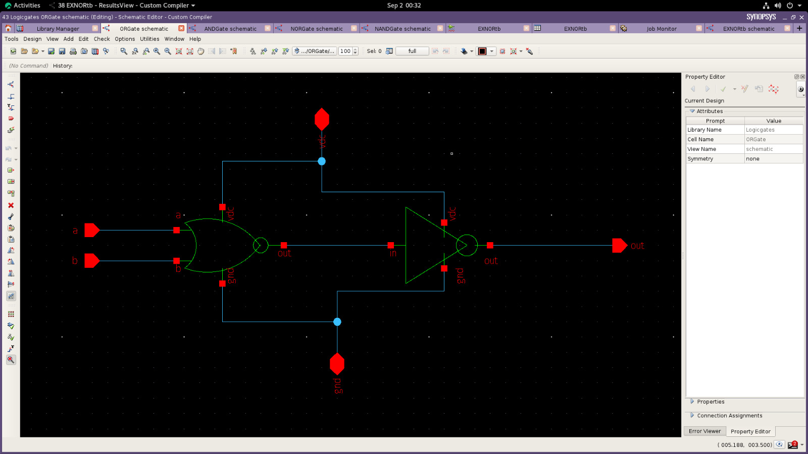
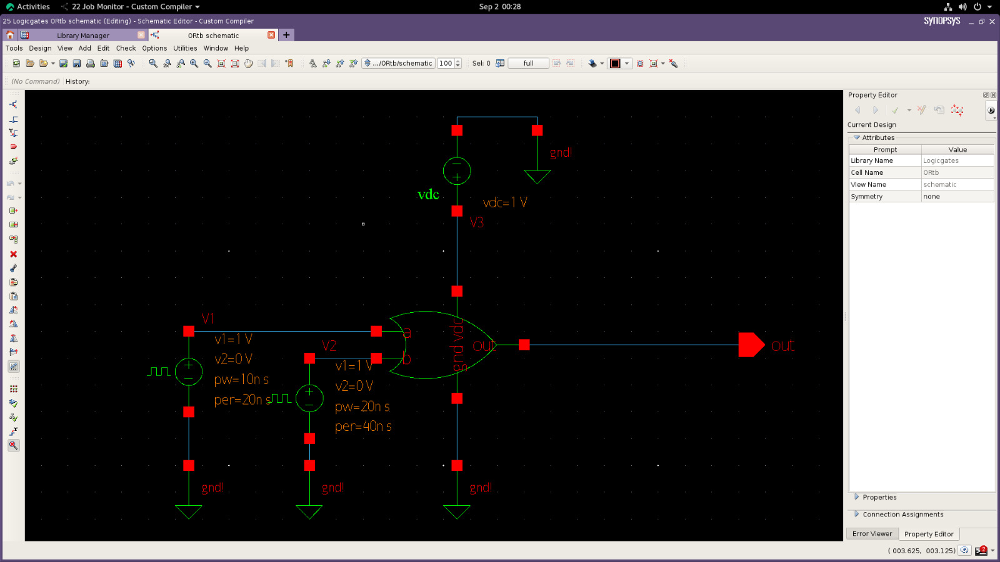
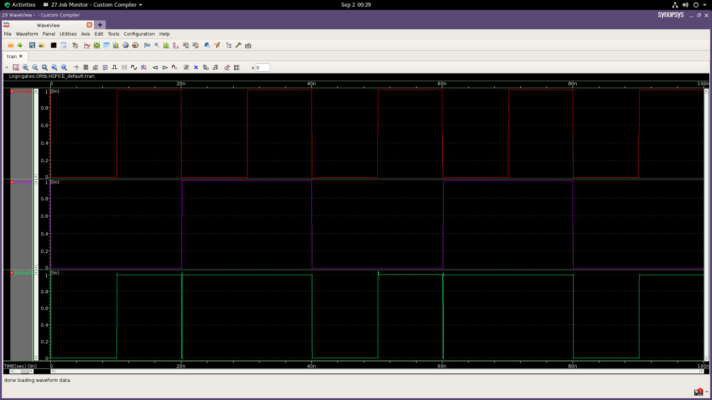

# OR Gate Design using Synopsys

This project demonstrates the design and simulation of an OR Gate using Synopsys tools.

## Tools Used

* Synopsys

## Project Contents

* OR Gate 
* Simulation waveform

## Output Images

### OR Schematic

### OR Symbol

### Waveform

## Author

Yogavelan M D
